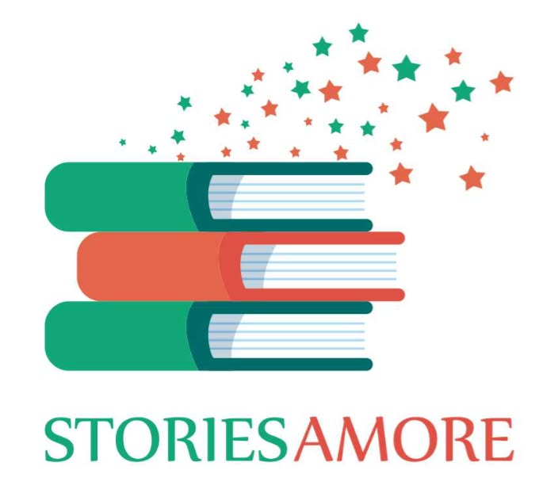

<!DOCTYPE html>
<html lang="en">
<head>
  <meta charset="UTF-8" />
  <meta name="viewport" content="width=device-width, initial-scale=1.0" />
  <title>StoriesAmore | Where Your Story Finds Its Voice</title>
  <meta name="description" content="StoriesAmore helps learners write with flow, speak with ease, and think with structure through storytelling-led programs." />
  
</head>
<body>
  <header>
    

      
      <button class="menu-btn" id="menuBtn" aria-label="Toggle Menu">Menu</button>
      <nav class="nav-links" id="navLinks">
        <a href="#about">About</a>
        <a href="#courses">Courses</a>
        <a href="#why-us">Why Us</a>
        <a href="#contact">Contact</a>
      </nav>
    

  </header>

  <main>
    <section class="hero" id="home">
      

        

          Storytelling-led learning
          <h1>Where your story finds its voice.</h1>
          

            At StoriesAmore, we believe every learner has something meaningful to say. Through storytelling,
            creative expression, and skill-based learning, we help children, students, and adults write with flow,
            speak with ease, and think with structure.
          

          

            <a href="#courses" class="btn btn-primary">Explore Courses</a>
            <a href="#contact" class="btn btn-secondary">Contact Us</a>
          

          

            

              <strong>Write with flow</strong>
              
Build clarity, structure, and confidence in writing.

            

            

              <strong>Speak with ease</strong>
              
Learn to express ideas naturally and powerfully.

            

            

              <strong>Think with structure</strong>
              
Turn scattered thoughts into meaningful communication.

            

          

        

        

          <h3>A small story about us</h3>
          

            We noticed something beautiful and heartbreaking at the same time: so many people had ideas,
            emotions, and dreams inside them, but not always the words to express them.
          

          

            

              So StoriesAmore was built as a space where language is not just taught — it is felt, explored,
              and lived. Here, storytelling becomes confidence. Reading becomes curiosity. Speaking becomes presence.
            

          

        

      

    </section>

    <section class="section" id="about">
      

        

          About StoriesAmore
          <h2>More than classes. A place for expression.</h2>
          

            StoriesAmore began with a simple belief: everyone has a story worth telling. Over time, that belief grew
            into a learning space where storytelling became the bridge to better writing, better speaking, and deeper confidence.
          

          

            Whether it is a student preparing for IELTS, a child discovering the joy of reading, or a learner finding their voice,
            our programs are designed to nurture both skill and self-expression.
          

        

        

          Why learn with us
          <h2>Learning that feels personal, practical, and alive.</h2>
          
Small batches for individual attention and meaningful guidance.

          
Personal feedback to help every learner improve with clarity.

          
Storytelling methods that build life skills beyond academics.

          
Practical learning rooted in communication, confidence, and creativity.

        

      

    </section>

    <section class="section" id="courses">
      

        Courses offered
        <h2>Programs designed to help every voice grow.</h2>
        

          Each course at StoriesAmore is built to strengthen expression, confidence, and real-world communication.
        

        

          

            <h3>IELTS Mastery Program</h3>
            
Prepare for your target band score with focused training in writing, speaking, listening, and reading.

          

          

            <h3>Creative Writing Classes</h3>
            
Explore imagination, narrative flow, character, and voice while learning to write beautifully.

          

          

            <h3>Public Speaking with Storytelling</h3>
            
Build stage confidence and learn to speak with presence, structure, and emotional connection.

          

          

            <h3>Reading Club</h3>
            
Create a habit of reading, reflection, and discussion in a warm and engaging community space.

          

          

            <h3>Personality Development with EQ</h3>
            
Develop emotional intelligence, self-awareness, empathy, and communication in everyday life.

          

          

            <h3>English Speaking Classes</h3>
            
Practice spoken English in a supportive environment that helps you express yourself naturally.

          

        

      

    </section>

    <section class="section">
      

        

          What makes us different
          <h2>We don’t just teach language. We shape confidence.</h2>
          

            “Writing essays that flow. Speaking with ease. Thinking with structure.”
          

          

            That is not just a classroom goal. It is a life skill. Our approach uses storytelling and creative writing techniques
            to help learners communicate with clarity, confidence, and heart.
          

        

        

          Get in touch
          <h2>Begin your StoriesAmore journey.</h2>
          

            Whether you want to join a course, ask about batches, or simply know more about our learning approach,
            we would love to hear from you.
          

          

            
Call us: <strong>9819739590</strong>

            
Email: <strong>storiesamore@gmail.com</strong>

          

          

            <a class="btn btn-secondary" href="tel:9819739590" style="background: white; color: var(--accent-dark); border: none;">Call Now</a>
            <a class="btn btn-secondary" href="mailto:storiesamore@gmail.com" style="background: transparent; color: white; border-color: rgba(255,255,255,0.35);">Email Us</a>
          

        

      

    </section>

    <section class="section" id="gallery">
      

        Our Moments
        <h2>Stories in action. Learning that comes alive.</h2>
        
From storytelling circles to reading clubs and workshops, here are glimpses of StoriesAmore in motion.

        

          
          
          
          
          
          
          
          
          
        

      

    </section>

  </main>

  <footer>
    

      
© 2026 StoriesAmore. Crafted with storytelling, warmth, and purpose.

    

  </footer>

  
</body>
</html>
